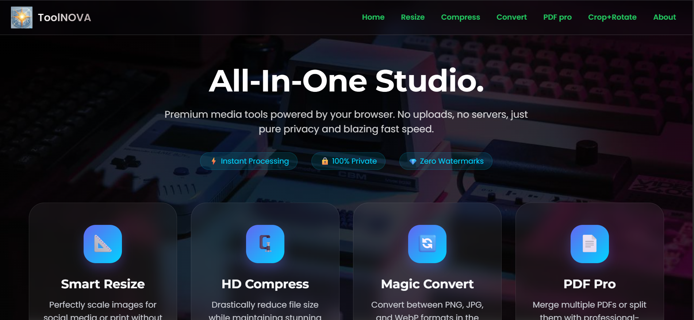
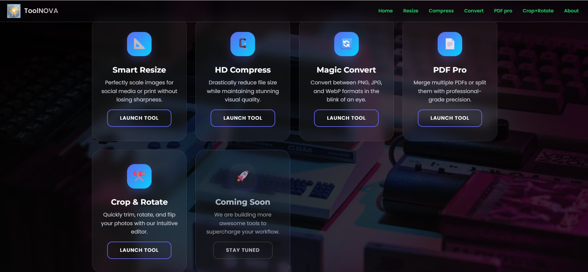
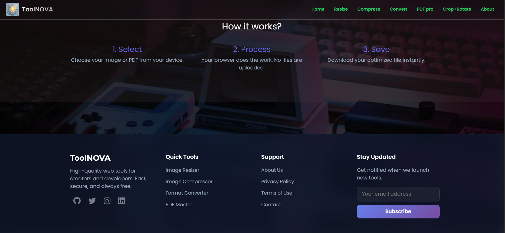
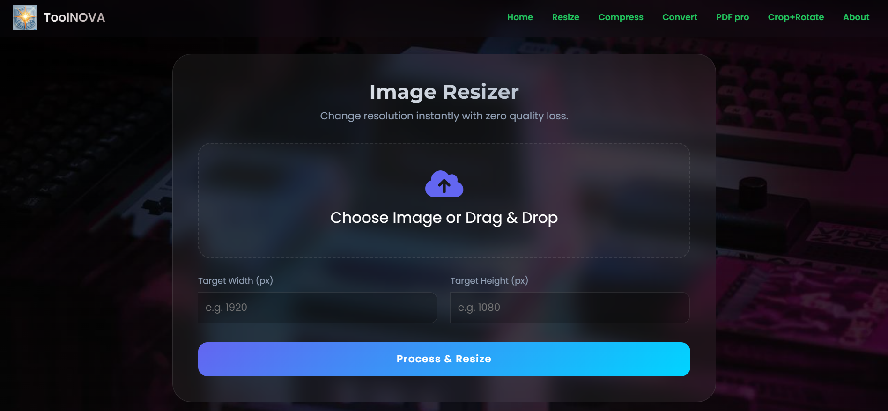
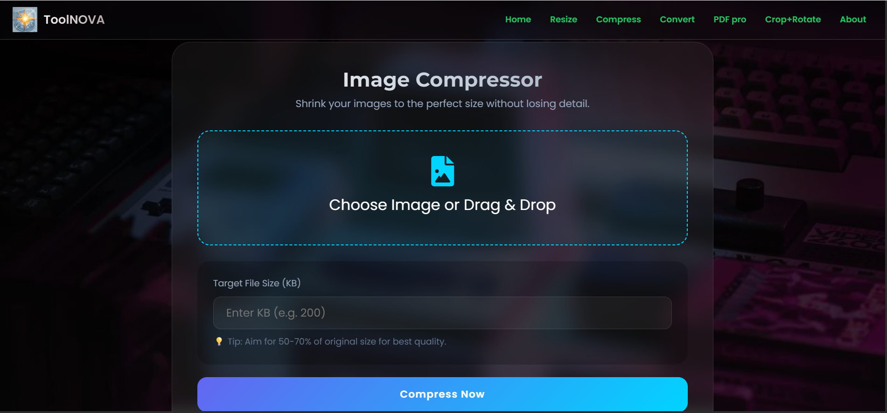
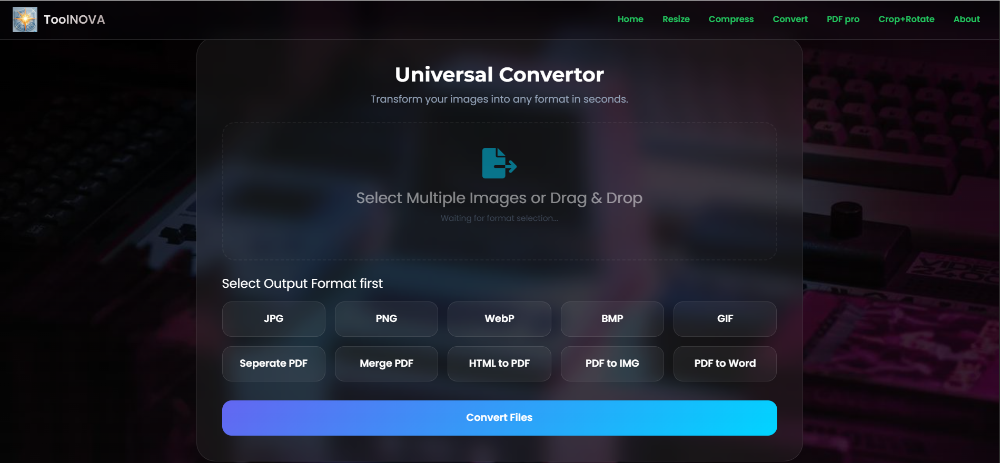
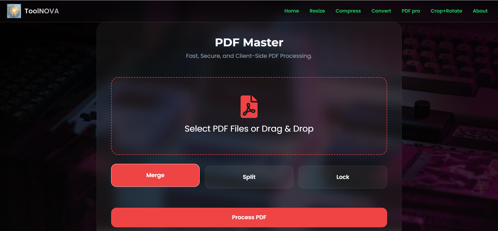
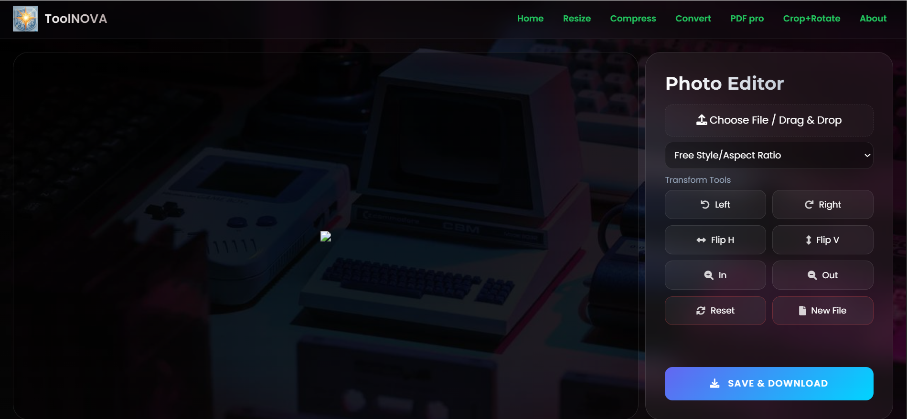
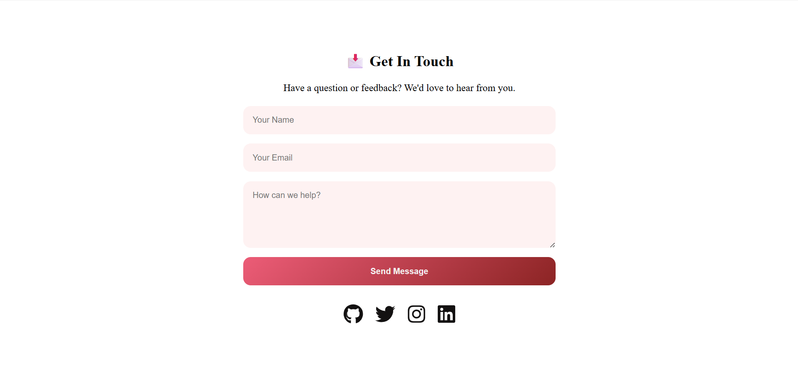

# 🌐 ToolNovaX - Frontend

ToolNovaX frontend is a static web interface that provides multiple utility tools like image resizing, compression, conversion, PDF tools, and more.

🔗 Live: https://toolnovax.vercel.app

---

## 🚀 Features

- 🖼️ Image Resize Tool
- 📉 Image Compression
- 🔄 Format Converter
- 📄 PDF Tools
- ✂️ Crop & Rotate Tool
- 📑 Static Pages (About, Contact, Privacy, Terms)

---

## 💡 Key Highlights

- 🚀 Built a multi-tool web platform handling real-time file processing
- ⚡ Optimized frontend for fast performance using pure HTML, CSS, JS
- 🔗 Integrated backend APIs for image and file operations
- 🌍 Deployed using Vercel with production-ready configuration
- 🐳 Backend containerized using Docker

---

## 🛠️ Tech Stack

- HTML5
- CSS3
- JavaScript

---

## 📁 Project Structure


Frontend/
├── static/
├── index.html
├── 01_resize.html
├── 02_compress.html
├── 03_convert.html
├── 04_pdftool.html
├── 05_croprotate.html
├── about.html
├── contact.html
├── privacy.html
└── terms.html


---

## 📸 Screenshots

### 🏠 Home Interface
<p align="center">
  
</p>

---
<p align="center">
  
</p>

---
<p align="center">
  
</p>

### 🖼️ Image Resize Tool
<p align="center">
  
</p>

### 📉 Image Compression
<p align="center">
  
</p>

### 🔄 Format Conversion
<p align="center">
  
</p>

### 📄 PDF Tools
<p align="center">
  
</p>

### ✂️ Crop & Rotate
<p align="center">
  
</p>

### ✅ Contact
<p align="center">
  
</p>

---

## ⚙️ How to Run

1. Clone repo:
```bash
git clone https://github.com/deepak-1252-git/Editor-Frontend.git
cd Frontend
Open in browser:
index.html

OR use VS Code Live Server.

🌍 Deployment
Hosted on Vercel
Configured using vercel.json
🔗 Backend Connection

Frontend interacts with backend APIs for:

Image processing
File conversion
PDF operations

🤝 Contributing

Fork → Branch → Commit → Push → PR

📄 License

MIT License

👨‍💻 Author

Deepak Bairwa